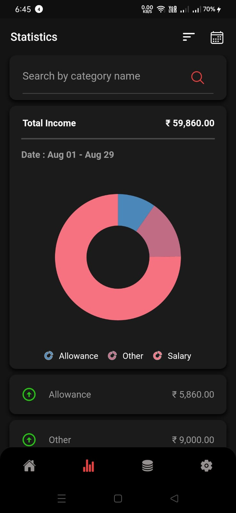
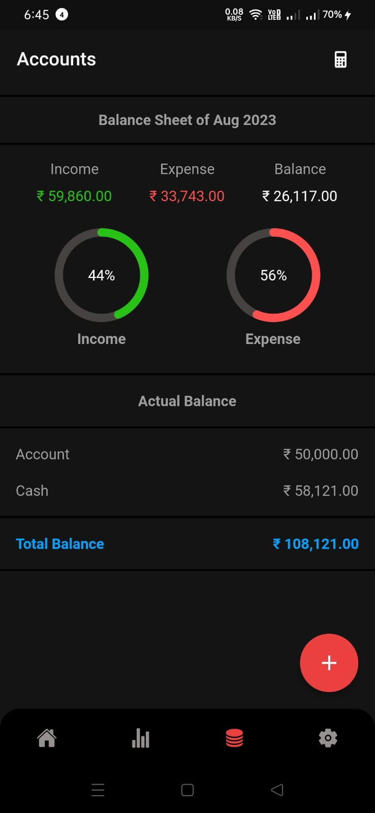
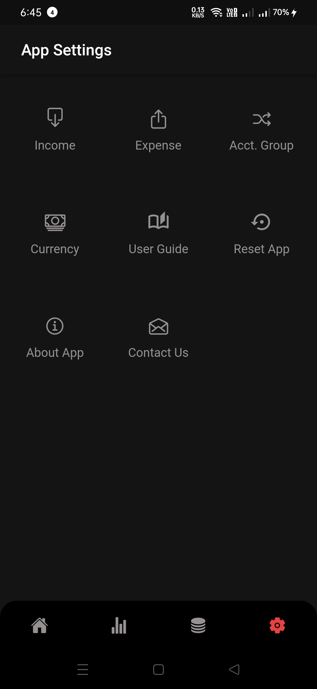
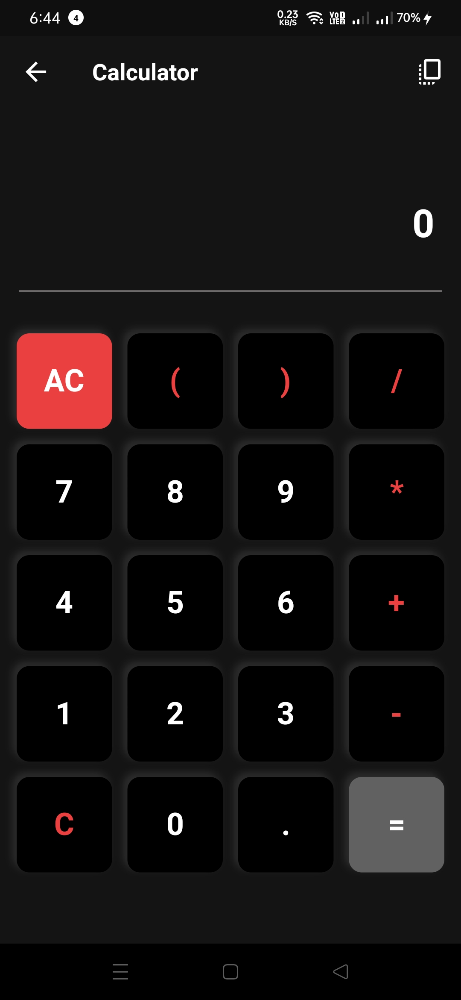

# FinTrackr - Empower Your Financial Journey

FinTrackr is an exceptional financial tracking application designed to put you in control of your personal finances. With its intuitive interface and robust features, FinTrackr empowers you to effortlessly manage income, expenses, and savings while gaining deep insights into your financial patterns. Whether you're budgeting, aiming for financial milestones, or making informed decisions, FinTrackr is your trusted companion.

## Features

1. **Seamless Transaction Management:** Effortlessly add income and expenses with the option to attach receipts for better record-keeping.


2. **Comprehensive Transaction Overview:** Get a holistic view of all your transactions. Review and analyze transactions based on categories, months, or perform specific category searches.


3. **Self Transfers:** Take control of your finances by easily transferring funds between accounts and cash. Flexibility at your fingertips.


4. **Insightful Statistics:** The statistics page presents graphical representations of your transactions. Leverage search and filter options to dive deep into your financial data.



5. **Account Balance at a Glance:** The account section provides real-time updates on your total account and cash balances, ensuring you're always informed.



6. **Customizable Settings:** Tailor FinTrackr to your preferences. Add, edit, or delete income sources and categories. Set opening balances for accounts and cash. Choose your preferred currency symbol. Access a user guide for clarity. And if needed, perform complete or transaction-only resets.




7. **Built-in Calculator:** Access a handy calculator right within FinTrackr, streamlining your financial calculations.



## Installation

Getting started with FinTrackr is a breeze:

1. Clone this repository:
   ```bash
   git clone https://github.com/yourusername/fintrackr.git
   ```

2. Install the necessary dependencies:
   ```bash
   npm install
   ```

3. Launch the application:
   ```bash
   npm start
   ```

4. Access FinTrackr through your web browser at `http://localhost:3000`.

## Contributing

We welcome contributions to enhance FinTrackr's capabilities. To contribute:

1. Fork the repository.

2. Create a new branch for your feature:
   ```bash
   git checkout -b feature/awesome-feature
   ```

3. Commit your changes:
   ```bash
   git commit -m "Add some awesome feature"
   ```

4. Push your branch:
   ```bash
   git push origin feature/awesome-feature
   ```

5. Open a pull request to merge your changes.

## License

This project operates under the [MIT License](LICENSE).

## Contact

For inquiries and suggestions, reach out to us at hellotechmalayalam@gmail.com.

Visit our website: [https://hellotechmalayalam.com/](https://hellotechmalayalam.com)

Follow us on YouTube: [Hello Tech Malayalam](https://www.youtube.com/c/hellotechmalayalam)
Follow us on Linkedin: [Joyal Joseph](https://www.linkedin.com/in/joyaljoseph/)

---

Start your journey towards financial well-being with FinTrackr!